## Étude de cas 
### Système d'échange de livres universitaires
Le Bureau du Développement Durable (BDD) de l'Université a mis en place un système d'échange de livres aux fins de développement durable et pour réduire les coûts pour les étudiants (les clients du système). La version initiale est rudimentaire et ne permet que deux fonctionnalités :

### CU01 - Ajouter un livre à échanger

Acteur principal : Client (étudiant)

**Préconditions :**

Le Client est identifié (par son nom d'utilisateur) et authentifié par son mot de passe.

**Scénario principal (succès)**
1.	Le Client démarre un nouvel ajout de livre. 
2.	Le Client entre le code ISBN du livre, ainsi que le code de sa condition. 
3.	Le Système enregistre le livre et présente sa description (titre, nombre de pages, auteurs, maison d'édition, no d'édition ). 

Le Client répète les étapes 2 à 3 jusqu'à ce qu'il ait saisi tous les livres à échanger. 

4.	Le Système présente la liste de livres que possède le Client. 

**Cas alternatifs**

3a. Le système affiche un message d'erreur puisque le livre n'existe pas.

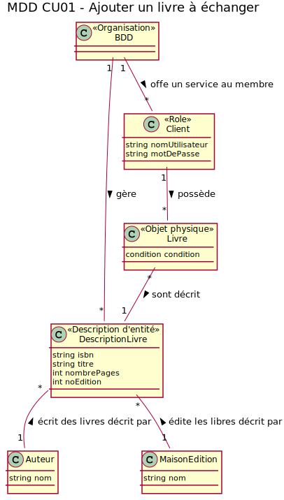

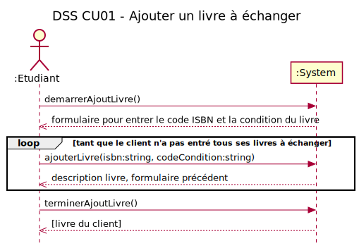

#### Contrats CU01-demarrerAjoutLivre

**Opération:** demarrerAjoutLivre()
**Préconditions:**
**PostConditions:**
- Aucune

#### contrat CU01-ajouterLivre 
**Opération:** ajouterLivre(tring isbn, string codeCondition)()
**Préconditions:**
- c:Client existe puisque le client doit être authentifié pour avoir accès à cette fonctionnalité

**PostConditions:**
- Une instance l:Livre a été créée
- Une association a été créé entre l:Livre et c:Client (précondition)
- Une association a été crée entre l:Livre et la classe DescriptionLivre sur la base de correspondance entre DescriptionLivre.isbn == isbs (paramètre)
- l.codeCondition est devenu codeCondition (paramètre)

#### Contrat CU01-terminerAjoutLivre
**Opération:** terminerAjoutLivre()
**Préconditions:**
***PostConditions:**
- Aucune

# RDCU's
## RDCU - demarrerAjoutLivre

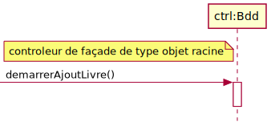

## RDCU CU01 -  ajouterLivre()
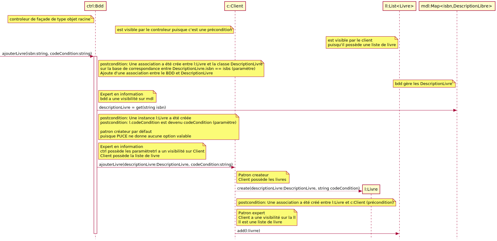

## RDCU CU01 -  terminerAjoutLivre()
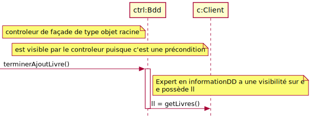

# CU02 - Proposer un échange de livres 
Acteur principal : Client (étudiant)

****Préconditions :****
Le Client est identifié (par son nom d'utilisateur) et authentifié par son mot de passe.

Scénario principal (succès) 

1.	Le Client démarre une nouvelle proposition d'échange de livres. 
2.	Le Système présente une liste d'autres Clients dans le système ainsi que le(s) livre(s) qu'ils ont à échanger. 
3.	Le Client sélectionne un autre Client (le Client Proposé) à qui il veut proposer un échange. 
4.	Le Système présente la liste de livres que possède le Client Proposé et une liste de livres que possède le Client. 
5.	Le Client ajoute à la proposition d'échange un livre. Si c'est un de ses livres, alors c'est à offrir dans la proposition. Sinon c'est un livre du Client Proposé et c'est à recevoir dans la proposition. Le Client répète l'étape 5. jusqu'à ce qu'il soit satisfait de la proposition. 
6.	Le Système présente le nombre total de livres à offrir et à recevoir et demande au Client de confirmer la proposition. 
7.	Le Client confirme et le Système enregistre sa proposition d'échange avec la date et l'heure. 
8.	Le Système envoie un courriel au Client Proposé pour l'informer de la proposition d'échange. 

#### CU02-Contrat-demarrerPropositionÉchange

**Opération :** demarrerPropositionÉchange()

**Préconditions :**
Une instance c de Client existe
Une instance bdd de BureauDeveloppementDurable existe

**Postconditions :**
Une instance p de PropositionEchange a été créée
Une association **"est-proposé-par"** a été créée entre l’instance p :PropositionEchange et c :Client

#### CU02-Contrat-choisirClient 

**Opération :** choisirClient(nomUtilisateur : string)

**Préconditions :**
Une instance c de Client existe
Une instance p de PropositionEchange existe

**Postconditions :**
Une assocation **"est-proposé-a"** entre p :PropositionEchange et client a été créée sur la base de correspondance avec le parametre idEtudiant
 
#### CU02-Contrat-proposerLivreRecevoir

**Opération :** proposerLivreRecevoir(idLivre :CodeLivre)

 **Préconditions :**
Une instance c de Client existe
Une instance p de PropositionEchange existe

**Postconditions :**
Une association **"recoit"** a été créée entre p :PropositionEchange et Livre sur la base de correspondance avec le paramètre idLivre

#### CU02-Contrat-proposerLivreOffrir

**Opération :** proposerLivreOffrir(idLivre :CodeLivre)

 **Préconditions :**
Une instance c de Client existe
Une instance p de PropositionEchange existe

**Postconditions :**
Une association **"offre"** a été créée entre p :PropositionEchange et Livre sur la base de correspondance avec le paramètre idLivre

#### CU02-Contrat-terminerProposition 

**Opération :** terminerProposition()

**Préconditions :**
Une instance c de Client existe
Une instance p de PropositionEchange existe

**Postconditions :**
p.dateHeure est devenu maintenant
 
#### CU02-Contrat-confirmerEchange 

**Opération :** confirmerEchange()
**Préconditions :**
Une instance c de Client existe
Une instance p de PropositionEchange existe

**Postconditions :**
Aucune

## RDCU-CU02-démarrerPropositionÉchange()
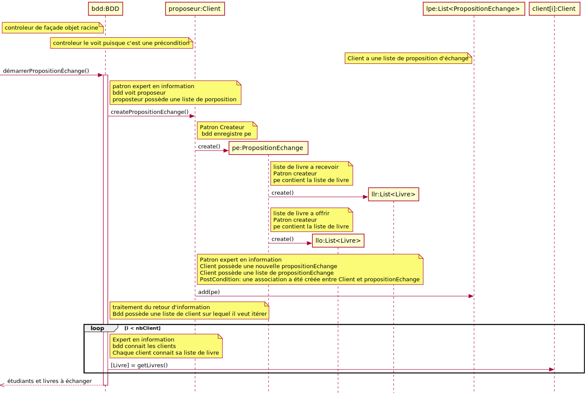

## RDCU-CU02-choisirClient()
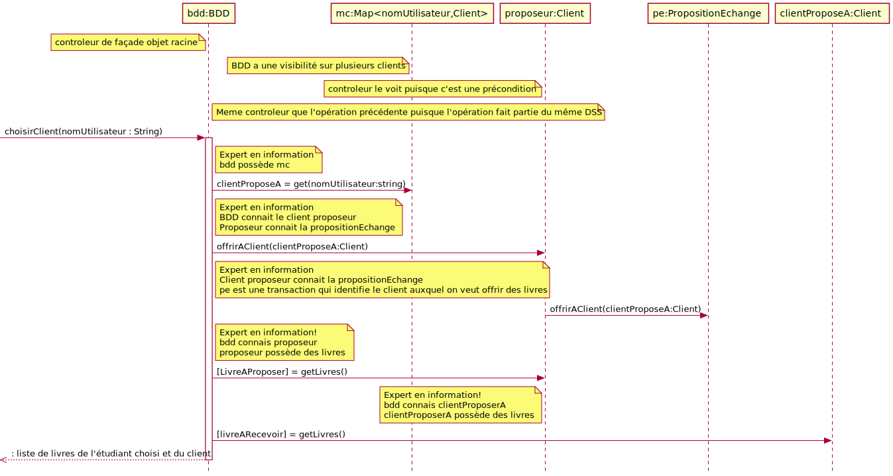

## RDCU-CU02-proposerLivreRecevoir
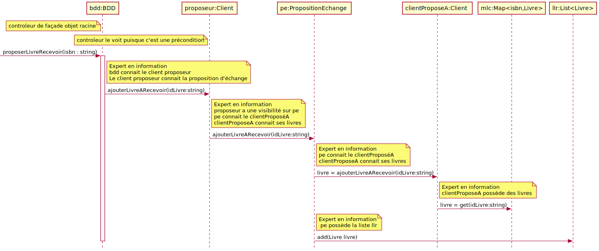

## RDCU-CU02-proposerLivreOffrir
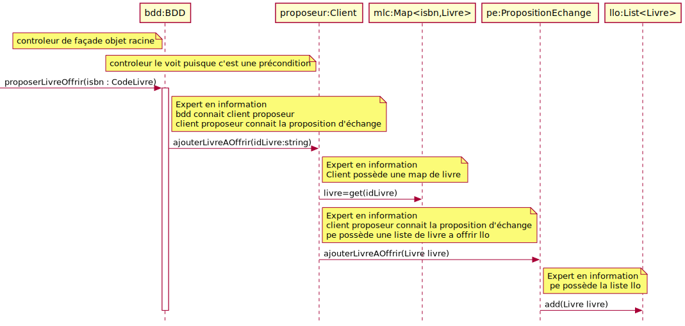

## RDCU-CU02-terminerProposition()
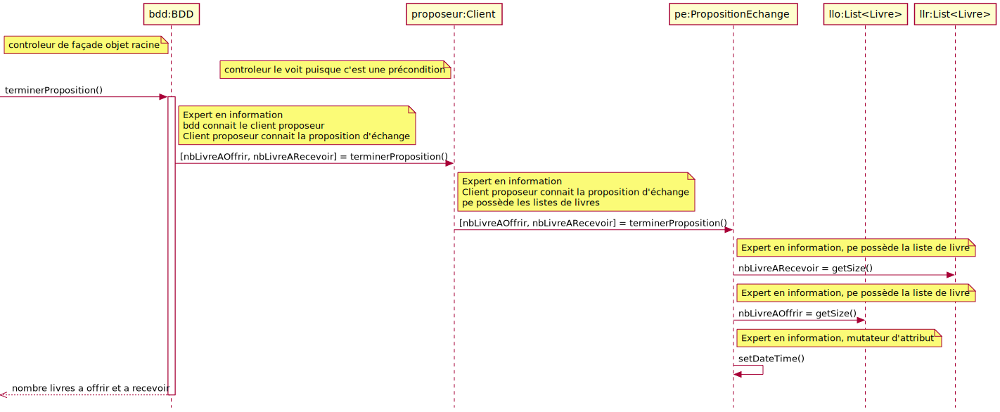

## RDCU-CU02-ConfirmerEchange()
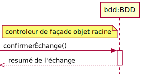

# Diagramme de classe logiciel CU01 et CU02

